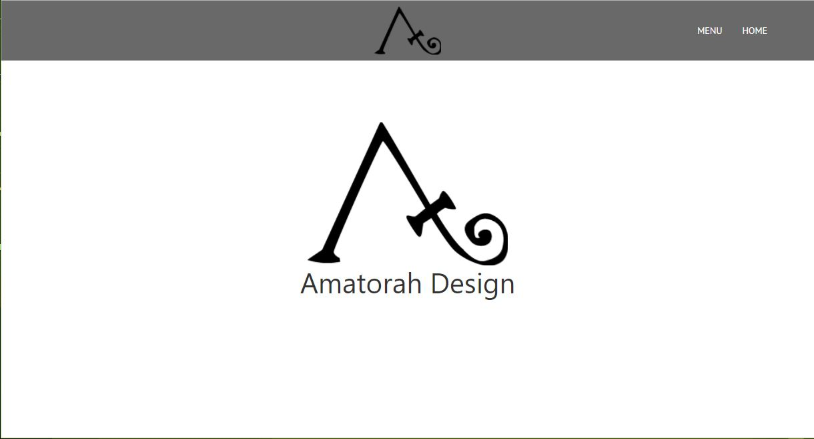
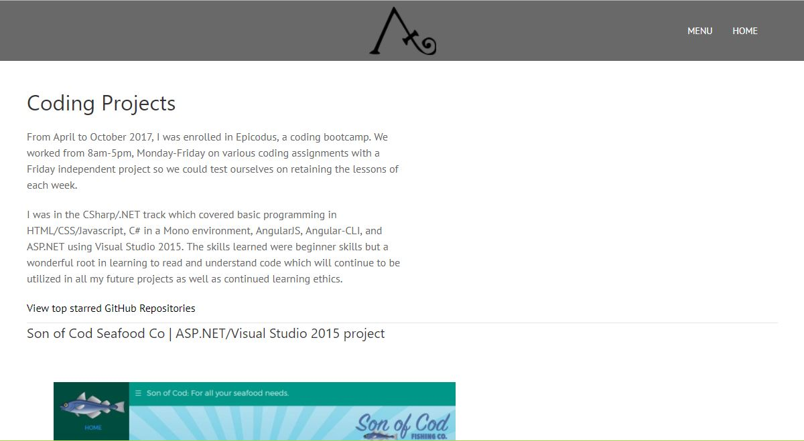
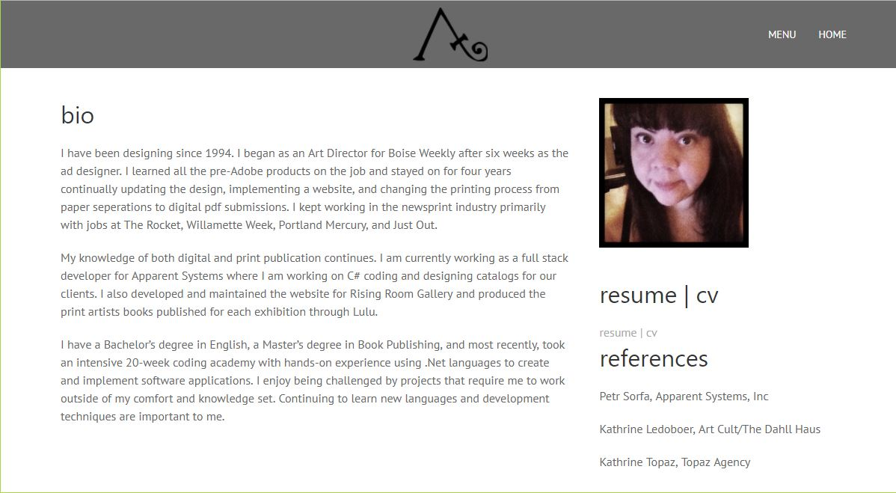
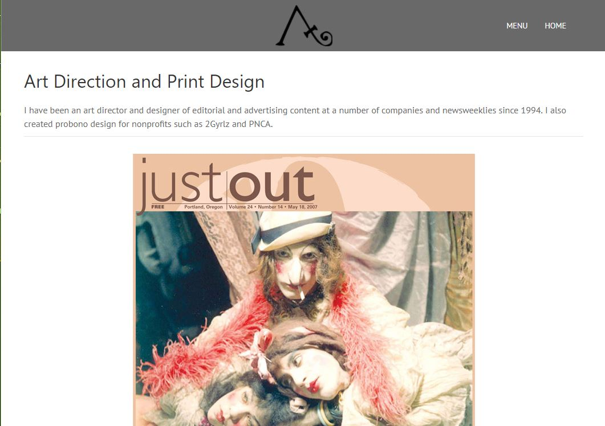

# Portfolio 

### An Epicodus Friday independent project in .NET/Visual Studio 2015 with API calls, 08.25.17

#### **By Anabel Ramirez**

## Description

A webpage to showcase personal work using GitHub API.

|Elements included|
|---|
|Landing Page |
|About Page |
|Projects Page with starred GitHub respositories|
|Print Portfolio Page with slideshow of work|
|Web Design Page with work and details about each project|
|Links to other professional web hosted portfolio profiles|


|Elements still to work on|
|---|
|Contact Form Page with authentication and sql server |
|Add more functionality to github repo api|
|About Page Resume attachment, link references |
|Illustration Portfolio Page needs to be built|
|Add samples and details to coding, web, print design pages|


## Setup/Installation Requirements

#### Requirements

If you do not have Visual Studio 2015, download [HERE](https://www.visualstudio.com/thank-you-downloading-visual-studio/?sku=Community&rel=15).

If you do not have SSMS, download [HERE](https://docs.microsoft.com/en-us/sql/ssms/download-sql-server-management-studio-ssms).

Cloning From GitHub: Download or clone project repository onto desktop from GitHub using this [link](https://github.com/AnabelGR/PortfolioDeux.git). In the command terminal, navigate to the src/PortfolioDeux folder and run the following command to restore packages:
```terminal
dotnet restore
```

Open the project in Visual Studio.

#### Migrations Setup

1. In Visual Studio, open the 'Solution Explorer' window.
2. Right-click the project root folder and choose 'Open in File Explorer' from the context menu.
3. Enter "cmd" in the address bar and press Enter.
4. Enter the following command in the command window:
```terminal
dotnet ef database update
```
5. Open portfolio_scripts.sql in SSMS and execute (this will add sample data).
6. Back in Visual Studio, click 'IIS Express' at the top of the window. Project will open in a new localhost window on your default browser.

## Screenshots

Index Page


Menu Side Drawer


Coding Portfolio Page


Bio / About Page


Print Portfolio with slideshow of work

## Support and contact details

If you have any issues or have questions, ideas, concerns, or contributions please contact the contributor through Github.

## Technologies Used

**Languages:** HTML, SCSS, C#, ASP.NET

**IDE:** Visual Studio 2015

**Design Framework:** UIKit

**Database Management:** MySQL (SSMS), GitHub API

### License
This software is licensed under the MIT license.

Copyright (c) 2017 **Anabel Ramirez**